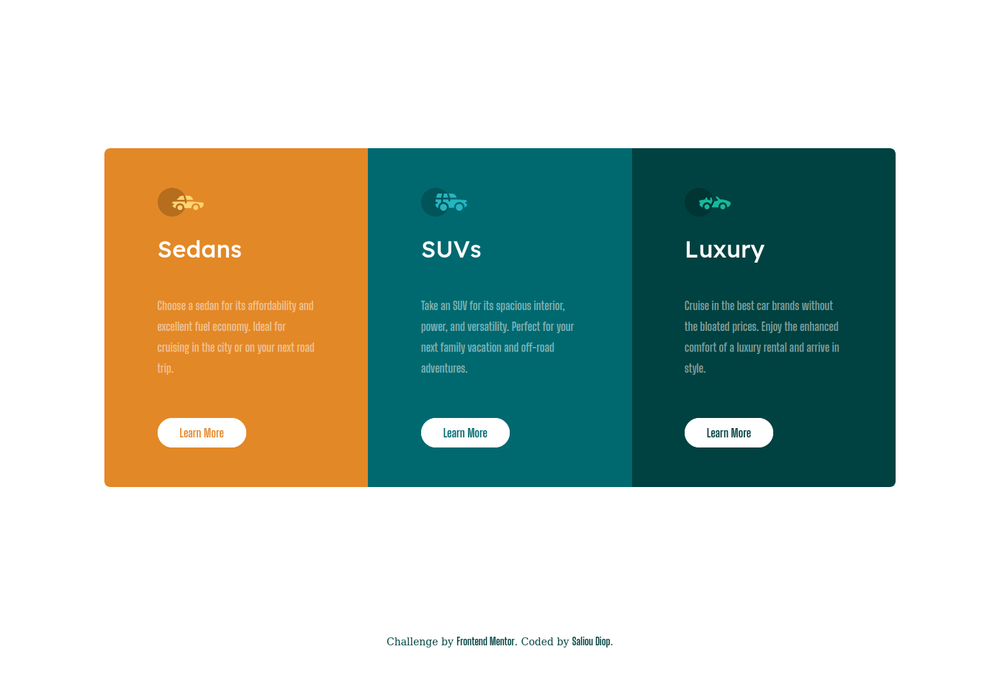
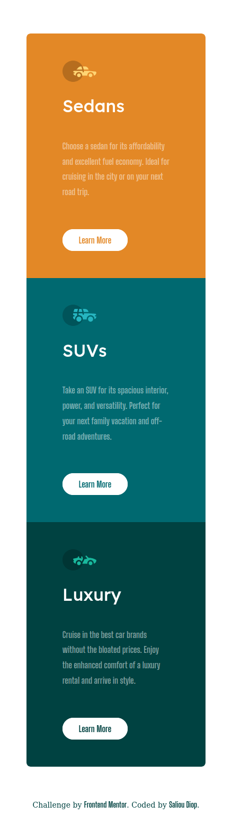

# Frontend Mentor - 3-column preview card component

## Welcome! 👋

## Table of contents

- [Overview](#overview)
  - [The challenge](#the-challenge)
  - [Screenshot](#screenshot)
  - [Links](#links)
  - [Built with](#built-with)
  - [Useful resources](#useful-resources)
- [Author](#author)

**Note: Delete this note and update the table of contents based on what sections you keep.**

## Overview

### The challenge

The challenge is to build out this 3-column preview card component and get it looking as close to the design as possible.

Users should be able to:

- View the optimal layout depending on their device's screen size

### Screenshot (My Solution)

### Links

- Live Site URL: [Here](https://saliou1920.github.io/Card-Component-Challenge/)

### Built with

- Semantic HTML5 markup
- CSS custom properties
- Flexbox
- CSS Grid

### Useful resources

- [MDN Web Docs](https://developer.mozilla.org/en-US/docs/Web/CSS/CSS_Grid_Layout/Basic_Concepts_of_Grid_Layout) - This helped me learn about CSS Grid. I really liked this pattern and will use it going forward.

## Author

- Linkedin - [@Saliou](https://www.linkedin.com/in/saliou-diop-527741112/)

